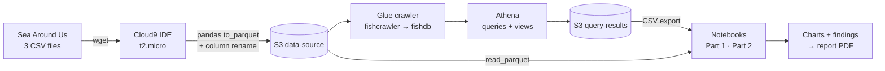

<h1 align="center">
AWS Capstone Project (DACF)
</h1>

<h3 align="center">
Capstone project (93DACF) for the Data Engineering modules, Diploma in Engineering Science, Ngee Ann Polytechnic. April 2026 semester. <br>
[<a href="https://github.com/lohjo/dacf_project/blob/main/src/report/DACF%20Project%20Report.pdf">Report</a>]
[<a href="https://github.com/lohjo/dacf_project/tree/main/data">Dataset</a>]
</h3>

## Project Overview

An end-to-end serverless pipeline on AWS over the [Sea Around Us](https://www.seaaroundus.org/data/) global fisheries dataset, followed by an analysis layer in Python.

Three CSV extracts are pulled from an HTTP endpoint into a Cloud9 IDE, converted to Apache Parquet with pandas, and landed in an S3 data-source bucket. An AWS Glue crawler infers the schema across all three files into the `fishdb` catalog. Amazon Athena queries the catalog and materialises three views, whose result sets are exported to CSV. Two Jupyter notebooks then take over: one reproduces and extends the Athena views with statistics and charts, the other goes back to the raw Parquet and mines the columns the views never touched.



The three source files deliberately overlap in scope so the EEZ-versus-high-seas comparison is possible:

| File | Scope | Rows | Tonnes | Landed value |
|---|---|---:|---:|---:|
| `SAU-GLOBAL-1-v48-0` | All open/high seas worldwide, 1950–2018 | 561,675 | 6,253.1 Mt | 9,167.1 bn USD |
| `SAU-HighSeas-71-v48-0` | Pacific, Western Central high seas only | 26,720 | 17.3 Mt | 2,506.8 bn USD |
| `SAU-EEZ-242-v48-0` | Fiji's Exclusive Economic Zone | 27,049 | 3.4 Mt | 81.7 bn USD |

The EEZ file ships with two mismatched column names (`fish_name`, `country`), renamed to `common_name` and `fishing_entity` before the Parquet conversion so the crawler catalogs one consistent schema.

## Repository Layout

```
data/
  SAU-GLOBAL-1-v48-0.parquet          # row-level source, Parquet-converted
  SAU-HighSeas-71-v48-0.parquet
  SAU-EEZ-242-v48-0.parquet
  Fiji_Yearly_Catch_value_vs_Volume_Trend.csv   # Athena view exports
  Makcerel_Catch_distrubution_Area(Using Existing View).csv
  Singapore_Fishing_Trend.csv
src/
  AWS Capstone Project (DACF) Part 1.ipynb                    # EDA + statistics
  AWS Capstone Project (DACF) Data Visualisation Part 2.ipynb # column mining
  report/DACF Project Report.pdf                              # written submission
```

## Pipeline (Tasks 1–3)

**Task 1 — environment and ingestion.** Cloud9 IDE on a t2.micro in the Capstone VPC public subnet; two S3 buckets in `us-east-1` (`data-source-*`, `query-results-*`). The global CSV is converted to Parquet and uploaded. Parquet is chosen for columnar layout and compression: Athena scans only the columns a query names, which is the dominant cost driver on a 561,675-row table.

**Task 2 — catalog and query.** Glue database `fishdb`, on-demand crawler `fishcrawler` running under `CapstoneGlueRole` against the data-source bucket. Athena is pointed at the query-results bucket and used to profile the data — notably `SELECT DISTINCT area_name`, which returns `Pacific, Western Central`, `Fiji`, and null (the global file carries no `area_name`). The `challenge` view sums Fiji's landed value across all high-seas areas since 2001, using `IS NULL` on `area_name` to reach the global rows.

**Task 3 — schema harmonisation and analysis.** The EEZ file is renamed, converted, uploaded, and the crawler re-run to pick up the widened schema. Three analytical views are then built and exported for the notebooks.

## Analysis Notebooks

**Part 1 — three questions, three result sets.** Runs in either of two modes and reports which: *row-level*, rebuilding every table from the source CSVs in pandas (reproducing the Athena SQL), or *aggregated*, falling back to the exported view CSVs if the source files are unreachable. Results are identical; row-level additionally runs the Parquet size/speed benchmark and a checkpoint validation against the Task 2 query outputs.

Chart type is chosen from the question, not the aesthetics, and each figure is checked against a fixed perceptual-honesty checklist — zero baselines on bars, labelled non-zero baselines where used, no unflagged dual axes. Methods follow the literature review: dual-axis correlation (Brath et al.), sparklines (Streit & Gehlenborg), traffic-light encoding (Levontin et al.), segmented regression (Pauly & Zeller), robust M-estimation with Huber and Tukey weights (Greco et al.), and point-outlier detection per Blázquez-García et al.

**Part 2 — the columns the views never used.** Part 1 plots `tonnes` and `landed_value` against `year` for three hand-picked slices. This notebook reads the Parquet directly and works the untouched columns — `catch_type`, `gear_type`, `end_use_type`, `reporting_status`, `functional_group`, `commercial_group`, `uncertainty_score`, `data_layer` — across the full global fleet panel. Every headline figure is derived at runtime into a `FINDINGS` dict; nothing is hardcoded. Section 10 is an assertion-based `check()` that reconciles each derived quantity against the source table and must pass before the findings print. Categorical series use the Okabe–Ito palette rather than Part 1's red/green pair, which is indistinguishable under deuteranopia.

## Key Findings

**Fiji, 2001–2018.** Volume is flat — 76,816 t/year on average, CV 4.4%, trending down 127 t/year, which is noise at this scale (p = 0.43). Value is twice as variable (CV 8.5%): implied unit price moves 21% between its 2002 low ($1,620/t) and 2009 high ($1,960/t). Volume explains 80% of the variance in value, so tonnage is a decent but incomplete proxy. The regression slope — $3,116 per additional tonne against a $1,816 average — says good years are differently composed, not simply bigger. OLS, Huber and Tukey fits agree within 2%, so no single observation is driving the result.

**Mackerel, 2015–2018.** 16,191 t across 20 countries, split 54.7% inside Fiji's EEZ and 45.3% in the adjacent Pacific, Western Central high seas. Fiji takes half the total but almost all of it at home: 90.1% of its own EEZ against 1.6% of the neighbouring high seas, where the US fleet lands 42.4%. HHI of 2,981 sits well past the conventional 2,500 concentration threshold. The asymmetry is jurisdictional, not geographic — same water, different legal regime, almost entirely different fleet.

**Singapore, 1969–2018.** Catch rose to 34,567 t in 1984, then collapsed to 2,707 t by 2018: 92% off the peak, −3.74% a year compounded. Segmented regression places the breakpoint at 1987, cutting residual SSE 76% against a single line, with the slope reversing from +887 to −573 t/year. Landed value adds nothing here — it is a constant $1,466/t applied to tonnage, which is why no paired value/volume chart appears for Singapore.

**Global panel.** 725 Mt discarded since 1950, carrying 1,062 bn USD of landed value that never reached a market; the discard rate peaked at 20.8% in 1955 and sat at 7.8% in 2018. World unreported share fell from 32.8% to 26.5%, but the spread across the 18 largest fleets runs from 3.0% to 72.0%. Fleet order reshuffled substantially — Peru rank 44 → 5, Canada 6 → 24 — while the top five fleets' share fell from 45% to 39%. And 80% of Fiji EEZ tonnage is reconstructed estimate rather than reported record, with a catch-weighted `uncertainty_score` of 2.24 on the SAU 1–4 scale, which bounds how far any of the above should be pushed.

## Getting Started

```bash
git clone https://github.com/lohjo/dacf_project.git
cd dacf_project
pip install pandas numpy matplotlib statsmodels pyarrow jupyter
jupyter notebook src/
```

Run Part 1 first. It looks for the source CSVs in `.`, `data/`, and a couple of mount paths, downloads them from the AWS lab bucket if absent, and falls back to the exported Athena CSVs in `data/` if the download fails. Part 2 requires the Parquet files in `data/` and is independent of Part 1's state.

Reproducing the AWS side needs an account with Cloud9, S3, Glue and Athena access, plus a role equivalent to `CapstoneGlueRole` for the crawler.

## Data Source

Pauly D., Zeller D., Palomares M.L.D. (eds.) *Sea Around Us Concepts, Design and Data*, v48. Files served via the AWS Academy lab bucket `aws-tc-largeobjects/CUR-TF-200-ACDENG-1-91570/lab-capstone/s3/`.

Figures are catch *reconstructions*, not landings records, and carry the uncertainty the source documents.

## Authors

* Vighnesh
* John (Loh John Ray)
* Anand

Engineering Science, Ngee Ann Polytechnic — July 2026
